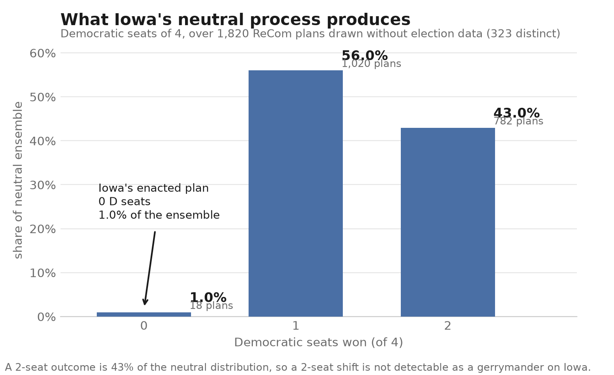

# districting-bench

A research system for evaluating legislative districting plans: it detects
likely gerrymanders against a neutral baseline, scores plans on many criteria at
once, and makes every value judgment an explicit, changeable parameter.

**Status: exploratory. Not validated. Do not use for litigation, advocacy, or
map adoption.**

---

## First result



Over 1,820 plans drawn with no access to election data, **Iowa's neutral process
spans 0–2 Democratic seats of 4, and a 2-seat outcome is 43% of the distribution.**

The consequence is a limit, not a score. Detectability is bounded below by the
width of the neutral distribution, and that width is a property of the state rather
than of the method. A detection target stated in absolute seats — such as
`docs/CRITERIA.md` §8's "≥0.95 true-positive rate at a 2-seat shift" — asks a
detector to separate an outcome from its own null, and is unreachable on a
four-district state whose null already spans two seats.

Iowa's enacted plan returns 0 D seats, which occurs in 1.0% of this ensemble. That
comparison is **not yet a finding**: the reference is not held to the 94-person
population equality the enacted plan meets, so it is not like-for-like. See
`docs/progress.md`.

---

## The three experiments

`prompt.md` asked for three measurements, each run once. All three are derived on
both states, with a written finding in `docs/progress.md` and a committed figure.

| | finding | figure |
| --- | --- | --- |
| **Criteria sensitivity** | competitiveness and mean-median bind; compactness barely moves anything. The *ordering* does not replicate across elections — only the bind/no-bind classification does. | `docs/figures/exp1-{ia,co}-v2-sensitivity.png` |
| **Tradeoff frontier** | Colorado: 20 of 21 relationships show nothing, testing Stephanopoulos (126 Colum. L. Rev. 1001). Iowa: 5 of 15, one large. Every null means "nothing stronger than ρ ≈ 0.13–0.22", not "no tradeoff". | `docs/figures/exp2-*.png` |
| **Metric gameability** | three legal Colorado plans on which a named fairness metric reads ≈0 while one party takes 7 or 8 of 8 seats. arXiv:2409.17186, reproduced here. | `docs/figures/exp3-gameability.png` |

The third is the one that constrains the other two: it is the demonstration of
why nothing in this repository emits a single fairness score.

---

## What this is not

This is not a tool that produces fair maps, and it does not claim to be
non-political.

There is no neutral districting criterion. Compactness, county integrity,
competitiveness, community preservation, and proportionality are all normative
choices with predictable and differing partisan consequences. Applying
"neutral" rules is itself a choice: because of how voters are distributed
geographically, criteria drawn blind to election results produce systematic
partisan effects. No amount of mathematics dissolves this.

What this system attempts is narrower and more defensible: make every choice
explicit, parameterized, and logged, so that a reader can see whose definition
of fair a given result encodes and substitute their own.

Any output of this system that reads as a verdict rather than a distribution is
a bug.

---

## The two halves, and why only one of them is optimized

**Detection** asks whether a given plan is an outlier relative to what the stated
legal criteria produce. This has manufacturable ground truth: build a
gerrymander deliberately, and you know it is one. That makes it measurable,
falsifiable, and safe to optimize against.

**Generation** asks what the fair map is. This has no ground truth, because
"fair" is contested at the definitional level. Every single-number fairness
metric in the literature — efficiency gap, mean-median, declination, GEO — is
provably gameable: a plan can produce a lopsided seat outcome while the metric
sits inside any reasonable bound. Optimizing toward such a metric produces a
gerrymander with a certificate of fairness attached.

So this repository builds both halves and optimizes only the first. See
`docs/CRITERIA.md` §8 for the detection gates and §5.2 for the gameability
result.

---

## The firewall

The ensemble generator must never see partisan or racial data. It receives
population, adjacency, geography, and subdivision boundaries — nothing else.
Partisan and demographic evaluation happens strictly downstream, in separate
code, with no path back into generation.

If those two halves touch, the neutral baseline is no longer neutral and every
outlier claim built on it is void.

This is enforced mechanically by `tools/check_firewall.py`, run in CI. The check
was written before any implementation code and **must not be modified, relaxed,
or worked around.** A change to the firewall config invalidates every result
produced after it.

```
src/generate/     population + geometry only. May not import from any sibling.
src/evaluate/     partisan + demographic metrics. Downstream only.
src/adversarial/  deliberately partisan: builds known gerrymanders for testing.
src/detect/       compares a plan to an ensemble. May import from all of the above.
```

Everything inside each package is an open design question. The boundary between
them is not.

---

## Setup

Python 3.11. From a clean clone:

```bash
python -m venv .venv && source .venv/bin/activate
pip install -r requirements.txt
```

**The tests run at this point, and most of them pass.** No data required:

```bash
PYTHONPATH=src pytest tests -q        # 573 passed, 151 skipped
```

The 151 skips are not a problem to fix — they are every test that needs real
census and election data, which is not in this repository (see below). CI runs
exactly this configuration on every push.

### Getting the data

`data/` is gitignored. The census inputs are public domain and scripted; the
election returns are neither.

```bash
tools/fetch_raw.sh            # ~700 MB of Census files, both states
                              #   (or: tools/fetch_raw.sh ia | co)
```

Then the election returns, **by hand** — VEST publishes on the Harvard Dataverse
behind a click-through that a script cannot accept for you:

- VEST, *2020 Precinct-Level Election Results*, <https://doi.org/10.7910/DVN/K7760H>
- Unpack Iowa to `data/raw/vest/ia_2020.shp` and Colorado to
  `data/raw/vest_co/co_2020.shp`. Those directory names are this repository's
  convention, not VEST's.

`tools/fetch_raw.sh` prints these instructions itself if the files are absent.

### Building the analysis inputs

```bash
python tools/prepare_data.py            # Iowa   -> data/processed/ia_*
python tools/prepare_data_co.py         # Colorado -> data/processed/co_*
python tools/prepare_municipalities.py  # place / statehouse / statesenate layers
```

`prepare_data.py` asserts the Iowa presidential totals (897,672 R, 759,061 D), so
a wrong or mis-vintaged VEST file fails loudly rather than quietly changing every
downstream number.

With the data built, the full suite runs:

```bash
PYTHONPATH=src pytest tests -q         # 719 passed, 5 skipped
python tools/check_firewall.py         # must print: clean
```

**Without the election returns you can still generate.** The neutral half needs
population, geometry and adjacency only — that is the firewall, not a
limitation. Every partisan metric and all three experiments need VEST.

### Reproducing the results

The experiments were each run once and are not meant to be re-run
(`prompt.md`: *"Run each once… do not iterate to improve the result"*). Their
outputs are committed. What you can re-derive from those committed artifacts:

```bash
python tools/experiment_1_sensitivity.py --ensemble v2
python tools/experiment_2_tradeoffs.py --ensemble v2      # hours; reads committed draws
python tools/phase_2_report.py

python tools/plot_experiment_1.py --ensemble v2   # -> docs/figures/exp1-*.png
python tools/plot_experiment_2.py --ensemble v2   # -> docs/figures/exp2-*.png
python tools/plot_experiment_3.py                # -> docs/figures/exp3-gameability.png
```

---

## Start here

1. `docs/CRITERIA.md` — every criterion, threshold, and metric, with a provenance
   class saying who decided it and whether it can be argued with. Read this
   before any code.
2. `prompt.md` — the task specification handed to the agent that built this.
3. `tools/check_firewall.py` — the boundary enforcement.
4. `docs/progress.md` — the full write-up: what was run, what it found, and
   every result that was later retracted and why.
5. `docs/DECISIONS.md` — D-001…D-037, each non-obvious choice logged when it was
   made rather than reconstructed afterwards.

---

## Scope

**Iowa** congressional districting came first: 99 whole counties, and Iowa Code
Chapter 42 supplies an explicitly ordered criteria list, which removes our
discretion over value choices that would otherwise be ours to make.

**Colorado** followed, and is precinct-level: 3,108 VTDs, 8 districts, drawn by an
independent commission under Amendments Y and Z. It exists because a four-district
whole-county state cannot exercise most of the machinery — Iowa's county-integrity
criterion is constant by construction, and its neutral seat distribution is too
narrow to test detection against. Colorado supplies the k=8 regime where fairness
metrics have room to be gamed.

Deliberately out of scope for now: ecological inference and racially polarized
voting analysis (documented in `docs/CRITERIA.md` §4.3, deferred for scope, not
because it is unimportant).

---

## Legal context, briefly

Partisan gerrymandering claims are not justiciable in federal court
(*Rucho v. Common Cause*, 2019). State courts have split on whether their own
constitutions permit such claims. Voting Rights Act §2 was substantially
narrowed by *Louisiana v. Callais* (April 2026).

The practical consequence is that the available remedy is jurisdiction-dependent
and currently narrow. Output from this system should not imply a cause of action
that does not exist where the reader lives.

---

## Attribution

Independent research project. Not affiliated with, endorsed by, or produced on
behalf of any redistricting commission, court, political party, campaign, or
advocacy organization. It takes no position on the merits of any cited decision
and is not connected to the author's employment.

## License

TBD before any public release.
